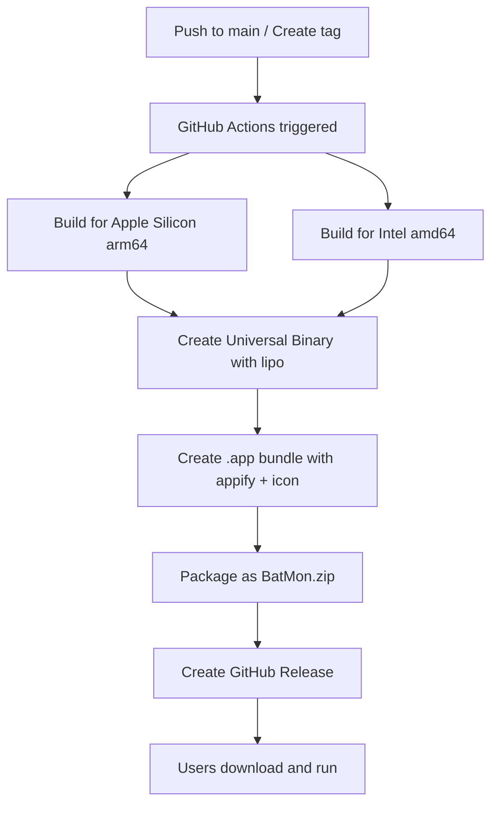

# 🚀 Настройка автоматической сборки macOS приложения

## ✅ Что было настроено

### 📋 GitHub Actions Workflow
Создан файл `.github/workflows/release.yml` который:

- **🔨 Собирает** Go бинарники для Intel и Apple Silicon
- **🔗 Создаёт** Universal Binary для максимальной совместимости
- **📱 Упаковывает** в macOS приложение (.app) с иконкой logo.png
- **🚀 Публикует** автоматические релизы при создании тегов
- **📊 Добавляет** контрольные суммы SHA256 для безопасности

### 🎯 Как это работает для пользователей

#### Для обычных пользователей (БЕЗ программирования):
1. Идут на [GitHub Releases](https://github.com/region23/batmon/releases/latest)
2. Скачивают `BatMon.zip` 
3. Распаковывают архив (двойной клик)
4. Запускают `BatMon.app` (двойной клик)
5. **Готово!** Никаких команд в терминале

#### Для разработчиков (как раньше):
- Клонируют репозиторий
- Собирают через `go build`
- Запускают в терминале

## 🔧 Техническая схема



## 📦 Создание релиза

### Автоматический релиз (рекомендуется)
```bash
# Создать тег версии
git tag v1.0.0
git push origin v1.0.0

# GitHub Actions автоматически создаст релиз
```

### Что произойдет автоматически:
1. ⚙️ Сборка Universal Binary (Intel + Apple Silicon)
2. 📱 Создание BatMon.app с иконкой
3. 📦 Упаковка в BatMon.zip
4. 🔒 Создание SHA256 контрольной суммы
5. 🚀 Публикация GitHub Release с описанием
6. 📝 Автоматические release notes с инструкциями

## 📊 Совместимость

Создаваемые релизы поддерживают:

- ✅ **MacBook с Apple Silicon** (M1, M2, M3)
- ✅ **MacBook с Intel процессорами** (x86_64)
- ✅ **macOS 12.0+** (Monterey и новее)
- ✅ **Universal Binary** - один файл для всех Mac
- ✅ **Автоматическая иконка** из logo.png

## 🛡️ Безопасность

- **SHA256 контрольные суммы** для проверки целостности
- **Стандартная структура** macOS приложения
- **Без подписи кода** (для получения подписи нужен Apple Developer Account)

### Предупреждение macOS о безопасности
macOS может показать предупреждение "неопознанный разработчик":

**Для пользователей:**
1. Откройте **Системные настройки** → **Конфиденциальность и безопасность**
2. Найдите сообщение о BatMon и нажмите **"Все равно открыть"**

**Альтернативно через терминал:**
```bash
xattr -d com.apple.quarantine /path/to/BatMon.app
```

## 📈 Преимущества для проекта

### 🎯 Для пользователей
- **Простота**: Скачай и запусти
- **Совместимость**: Работает на всех Mac
- **Безопасность**: Контрольные суммы
- **Обновления**: Уведомления о новых версиях

### 🔧 Для разработчика  
- **Автоматизация**: Релизы создаются автоматически
- **Качество**: Единый процесс сборки
- **Отслеживание**: Статистика скачиваний
- **Профессионализм**: Готовое к распространению приложение

## 🎉 Результат

Теперь BatMon - это **профессиональное macOS приложение**, которое:

1. **Скачивается** как обычное Mac приложение
2. **Запускается** двойным кликом
3. **Работает** на всех современных MacBook
4. **Обновляется** через GitHub Releases
5. **Выглядит** как стандартное macOS приложение с иконкой

Пользователям больше не нужно знать что такое терминал или Go - они просто скачивают и используют!