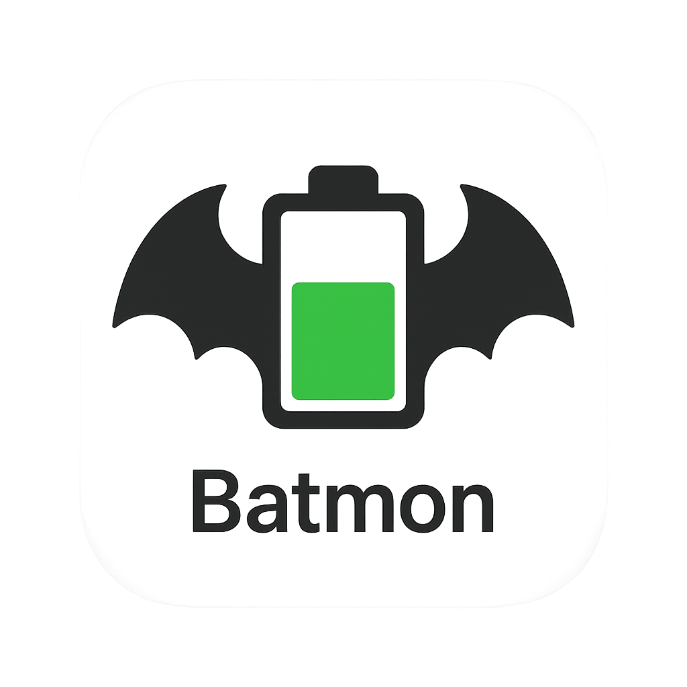

# 🔋 BatMon - Интеллектуальный мониторинг батареи MacBook



*Продвинутая консольная утилита для мониторинга и анализа состояния батареи MacBook с интерактивным дашбордом, детальной аналитикой и экспортом отчетов.*

## ⚡ Быстрый старт для новых пользователей

**Хотите сразу попробовать?** Скопируйте эту команду в Терминал:

```bash
git clone https://github.com/region23/batmon.git && cd batmon && go build -o batmon && ./batmon
```

*Требуется Go (установите с [golang.org](https://golang.org/dl/) или `brew install go`)*

**Что произойдет:**

1. 📥 Скачается код программы
2. 🔨 Соберется исполнимый файл  
3. 🚀 Запустится интерактивное меню
4. ⌨️ Нажмите `1` для интерактивного мониторинга

**Управление:** используйте `q`/`й` для выхода, `r`/`к` для обновления данных

## 👶 Пошаговая инструкция для новичков

**Если вы никогда не работали с Терминалом:**

### Шаг 1: Откройте Терминал

- 🔍 Нажмите `Cmd + Space` (Spotlight)
- 💬 Наберите "Терминал" или "Terminal"
- ⏎ Нажмите Enter

### Шаг 2: Установите Go (если еще нет)

```bash
# Проверьте, установлен ли Go
go version

# Если появилась ошибка, установите Go:
/bin/bash -c "$(curl -fsSL https://raw.githubusercontent.com/Homebrew/install/HEAD/install.sh)"
brew install go
```

### Шаг 3: Скачайте и запустите BatMon

```bash
# Скопируйте эту команду целиком и вставьте в Терминал:
git clone https://github.com/region23/batmon.git && cd batmon && go build -o batmon && ./batmon
```

### Шаг 4: Пользуйтесь программой

- 📊 В меню выберите `1` для интерактивного мониторинга
- ⌨️ Используйте `q` или `й` для выхода  
- 🔄 Используйте `r` или `к` для обновления данных
- 📖 Используйте `h` или `р` для справки

**🎉 Готово!** Теперь вы можете отслеживать состояние батареи MacBook!

### ❓ Частые вопросы новичков

**Q: Что делать, если появляется ошибка "command not found: git"?**  
A: Установите Xcode Command Line Tools: `xcode-select --install`

**Q: Что делать, если появляется ошибка "command not found: go"?**  
A: Установите Go через Homebrew: `brew install go`

**Q: Безопасно ли запускать эти команды?**  
A: Да, код открытый на GitHub, можете просмотреть перед установкой

**Q: Где сохраняются данные?**  
A: В файле `batmon.sqlite` в папке с программой

**Q: Как удалить программу?**  
A: Просто удалите папку `batmon` и файл `batmon.sqlite`

### 🛡️ Безопасность

- ✅ Код полностью открытый - можете проверить на [GitHub](https://github.com/region23/batmon)
- ✅ Программа только читает данные батареи - ничего не изменяет
- ✅ Никаких сетевых подключений - все работает локально
- ✅ Не требует прав администратора

## ✨ Возможности

### 🎨 Интерфейс и визуализация

- 🌈 **Цветной интерактивный интерфейс** - критические значения красным, нормальные зеленым
- 😊 **Эмодзи индикаторы** - визуальные маркеры состояния (🔋, ⚡, 🌡️, ⚠️)
- 📊 **Интерактивный дашборд** - графики заряда и емкости в реальном времени
- 📋 **Структурированные отчеты** - краткое резюме и детальная статистика
- 🕐 **Локализация времени** - отображение в местном часовом поясе
- 🌍 **Мультиязычная поддержка** - горячие клавиши работают с русской, немецкой и французской раскладками
- 📺 **Адаптивные макеты** - автоматическое масштабирование при изменении размера терминала

### 📈 Мониторинг и аналитика

- 🌡️ **Мониторинг температуры** - отслеживание нагрева батареи с предупреждениями
- 📉 **Анализ трендов** - прогноз деградации на основе исторических данных
- 🔄 **Детекция циклов** - анализ полных циклов заряда-разряда
- ⚡ **Нормализованные аномалии** - интеллектуальное выявление необычного поведения
- 🎯 **Персонализированные рекомендации** - советы по оптимизации использования батареи
- ⚡ **Расширенные метрики** - напряжение, ток, мощность и статус Apple
- 🏆 **Комплексная оценка здоровья** - рейтинг состояния батареи (0-100)

### 📄 Экспорт и отчеты

- 📝 **Markdown отчеты** - детальные отчеты с таблицами и статистикой
- 🌐 **HTML отчеты** - интерактивные отчеты с графиками Chart.js
- 📊 **Командная строка** - флаги `-export-md` и `-export-html` для автоматизации
- 🔇 **Тихий режим** - флаг `-quiet` для скриптов

### ⚡ Производительность и хранение

- 💾 **Буферизация в памяти** - последние 100 измерений в RAM для быстрого доступа
- 🧹 **Автоматическая ретенция** - очистка данных старше 3 месяцев
- 📈 **Статистика использования** - мониторинг размера буфера и базы данных
- 💾 **WAL режим SQLite** - устранение блокировок при одновременном чтении/записи
- ⚡ **Оптимизированная частота опроса** - адаптивные интервалы сбора данных

## 🎯 Принцип работы

### 🔋 При работе от батареи

- 📊 **Интерактивный дашборд** с графиками температуры и емкости в реальном времени
- 🔄 **Фоновый сбор данных** с оптимизированной частотой опроса
- ⚡ **Автоматическое обновление** каждые 10 секунд
- 📈 **Живая визуализация** - графики обновляются по мере поступления данных

### 🔌 При работе от сети

- 📋 **Детальный отчет** по сохраненным данным с анализом трендов
- 🔮 **Прогнозы** срока службы батареи на основе истории деградации
- 💡 **Рекомендации** по оптимизации работы с батареей
- 📊 **Статистический анализ** с выявлением аномалий

## 🚀 Установка

### Требования

- macOS (протестировано на Apple Silicon и Intel)
- MacBook с батареей

### 📦 Для обычных пользователей (без программирования)

**Простой способ - скачать готовый файл:**

1. Откройте **Терминал** (найдите через Spotlight или в Программы → Утилиты)

2. Скачайте и запустите одной командой:

   ```bash
   curl -L https://github.com/region23/batmon/releases/latest/download/batmon-macos -o batmon && chmod +x batmon && ./batmon
   ```

   *Если ссылка не работает, используйте способ ниже ↓*

3. **Альтернативный способ - сборка из исходников:**

   ```bash
   # Скачиваем код
   git clone https://github.com/region23/batmon.git
   cd batmon
   
   # Собираем приложение (требуется Go)
   go build -o batmon
   
   # Запускаем
   ./batmon
   ```

4. **Если у вас нет Go**, установите его:
   - Скачайте с [golang.org](https://golang.org/dl/)
   - Или через Homebrew: `brew install go`

**🎯 Что дальше?**

- При первом запуске выберите `1` для интерактивного мониторинга
- Используйте клавиши `q`/`й` для выхода, `r`/`к` для обновления
- Все данные сохраняются в файл `batmon.sqlite` в той же папке

### 🛠️ Для разработчиков

- Go 1.24+ (для сборки из исходников)

### Сборка из исходников

```bash
git clone https://github.com/region23/batmon.git
cd batmon
go mod tidy
go build -o batmon
```

### 🚀 Быстрый старт

**Для обычных пользователей:**

```bash
# Просто запустите программу
./batmon

# Выберите пункт меню:
# 1 - Интерактивный мониторинг (рекомендуется)
# 2 - Детальный отчет
```

**Для продвинутых пользователей:**

```bash
# Экспорт отчетов
./batmon -export-md battery_report
./batmon -export-html battery_report

# Тихий режим для автоматизации
./batmon -export-md report -quiet
```

## 📋 Использование

### 🎯 Интерактивный режим

Запустите программу без аргументов для интерактивного меню:

```bash
./batmon
```

**Доступные опции в меню:**

- **1️⃣ Интерактивный мониторинг** - автоматически определяет режим работы:
  - При работе от батареи: интерактивный дашборд с графиками
  - При работе от сети: детальный отчет по данным
- **2️⃣ Детальный отчет** - анализ всех сохраненных данных с цветным выводом
- **3️⃣ Экспорт отчетов** - сохранение в Markdown или HTML форматы
- **4️⃣ Статистика и настройки** - информация о базе данных и расширенные метрики
- **5️⃣ Справка** - подробная документация по всем возможностям
- **0️⃣ Выход** - завершение программы

### 🔧 Командная строка

Для автоматизации и скриптов доступны прямые команды:

```bash
# Экспорт в Markdown
./batmon -export-md battery_report

# Экспорт в HTML с интерактивными графиками
./batmon -export-html battery_report

# Тихий режим (без вывода в консоль)
./batmon -export-md report -quiet

# Справка по флагам
./batmon --help
```

### 📁 Создаваемые файлы

- `battery_report.md` - Markdown отчет с таблицами и статистикой  
- `battery_report.html` - HTML отчет с интерактивными графиками Chart.js
- `batmon.sqlite` - База данных SQLite с историей измерений

## 🎨 Интерактивный дашборд

При работе от батареи отображается дашборд с графиками и статистикой:

```text
┌─── Заряд батареи (%) ─────────┐┌─── Текущая емкость (мАч) ────┐
│                               ││                              │
│     ████████████████████      ││     ████████████████████     │
│                               ││                              │
└───────────────────────────────┘└──────────────────────────────┘

┌─── Текущее состояние ─────────┐┌─ Заряд батареи ─┐
│ 🔋 Заряд: 87%                 ││ ████████████ 87%│
│ ⚡ Состояние: 🔋 Discharging   │├─ Износ батареи ──┤
│ 🔄 Циклы: 245                 ││ ███████        7%│
│ 📉 Износ: 7.2%                │├─ Последние измер─┤
│ ⏱️  Скорость: 458 мАч/ч       ││ Время  │Заряд│   │
│ ⏰ Время: 4h 12m              ││ 14:30  │ 89% │   │
│ 🌡️ Температура: 28°C          ││ 14:31  │ 88% │   │
│                               ││ 14:32  │ 87% │   │
│ Здоровье: Хорошее (85/100)    │└─────────────────┘
│                               │
│ ⌨️ 'q'/'й' / Ctrl+C - Выход  │
│ 🔄 'r'/'к' - Обновить данные │
│ 📊 'h'/'р' - Показать справку │
│ 🌍 Поддержка русской раскладки│
└───────────────────────────────┘
```

**Особенности дашборда:**

- 📊 Графики заряда и емкости обновляются в реальном времени
- 🌡️ Мониторинг температуры с цветовыми индикаторами
- ⚠️ Счетчик аномалий и предупреждений
- 🎯 Комплексная оценка здоровья батареи
- ⚡ Автообновление каждые 10 секунд
- 🌍 **Мультиязычные горячие клавиши:**
  - `'q'/'й'` / Ctrl+C - выход из мониторинга
  - `'r'/'к'` - принудительное обновление данных
  - `'h'/'р'` - показать справку
  - Поддерживаются русская, немецкая и французская раскладки

## 📊 Аналитика и метрики

### Краткое резюме

```text
💼 === КРАТКОЕ РЕЗЮМЕ ===
Здоровье батареи: Хорошее (рейтинг 85/100)
Циклы: 245
Износ: 7.2%
Оставшееся время: 4h 12m
```

### Детальный анализ здоровья

```text
=== Анализ здоровья батареи ===
Общее состояние: Хорошее (оценка: 85/100)
Износ батареи: 7.2%
📈 Тренд деградации: -0.3% в месяц
🔮 Прогноз до 80% емкости: ~890 дней

⚠️ Обнаружено аномалий: 2
  • Резкое падение заряда: 85% → 60% за 2.1 мин (12:34:56)
  • Высокая температура батареи (42°C) за 1.0 мин (13:45:20)

💡 Рекомендации:
  • Повышенная температура батареи - рассмотрите улучшение охлаждения
  • Проверьте настройки энергосбережения
```

### Отслеживаемые метрики

- 🌡️ **Температура батареи** - мониторинг перегрева (критично >40°C)
- 📈 **Тренд деградации** - процент деградации в месяц
- 🔮 **Прогноз срока службы** - дни до падения емкости до 80%
- ⚡ **Нормализованные аномалии** - пороги адаптируются к интервалам измерений
- ⚡ **Напряжение** - мониторинг напряжения батареи (мВ)
- 🔌 **Ток заряда/разряда** - анализ силы тока (мА)
- 💡 **Мощность** - вычисляемая мощность энергопотребления (мВт)
- 🍎 **Статус Apple** - официальная диагностика от Apple
- 📊 **Комплексные метрики** - эффективность, стабильность, рейтинг здоровья

## 📄 Примеры отчетов

### Markdown отчет

```markdown
# 🔋 Отчет о состоянии батареи MacBook

## 💼 Краткое резюме
- **Здоровье батареи:** Хорошее (рейтинг 85/100)
- **Циклы:** 245
- **Износ:** 6.6%
- **Оставшееся время:** 4h 12m

## 🔋 Текущее состояние батареи
| Параметр | Значение |
|----------|----------|
| Заряд | 87% |
| Состояние | Discharging |
| Напряжение | 12456 мВ |
| Ток | -1234 мА |
| Мощность | 15375 мВт |
| Статус Apple | Normal |
```

### HTML отчет

HTML отчеты включают:

- 📊 **Интерактивные графики** с Chart.js для визуализации данных
- 📱 **Адаптивный дизайн** для просмотра на любых устройствах  
- 🎨 **Цветовая кодировка** состояний и метрик
- 📋 **Детальные таблицы** с последними измерениями
- 🌐 **Готовность к публикации** - можно открыть в любом браузере

### Цветовые индикаторы

- 🟢 **Зеленый** - отличное состояние (износ <10%, заряд >50%, температура <30°C)
- 🟡 **Желтый** - требует внимания (износ 10-20%, заряд 20-50%, температура 30-40°C)  
- 🔴 **Красный** - критическое состояние (износ >20%, заряд <20%, температура >40°C)

## 🗄️ База данных

BatMon использует SQLite для хранения исторических данных:

```sql
CREATE TABLE measurements (
    id INTEGER PRIMARY KEY AUTOINCREMENT,
    timestamp TEXT NOT NULL,
    percentage INTEGER,
    state TEXT,
    cycle_count INTEGER,
    full_charge_capacity INTEGER,
    design_capacity INTEGER,
    current_capacity INTEGER,
    temperature INTEGER DEFAULT 0,      -- Температура батареи (°C)
    voltage INTEGER DEFAULT 0,          -- Напряжение (мВ)
    amperage INTEGER DEFAULT 0,         -- Ток заряда/разряда (мА)
    power INTEGER DEFAULT 0,            -- Мощность (мВт)
    apple_condition TEXT DEFAULT ''     -- Статус от Apple
);
```

### Особенности хранения данных

- 💾 **WAL режим SQLite** - устранение блокировок при чтении/записи
- 🧹 **Автоматическая ретенция** - старые данные (>3 месяцев) удаляются
- 📦 **Буферизация в памяти** - последние 100 измерений для быстрого доступа
- ⚡ **Оптимизированные запросы** - сокращение обращений к диску
- 📊 **Статистика использования** - мониторинг размера и производительности

## 🌍 Мультиязычная поддержка клавиатуры

BatMon поддерживает горячие клавиши для различных раскладок клавиатуры, что позволяет пользователям комфортно работать без переключения на английскую раскладку.

### Поддерживаемые раскладки

#### 🇷🇺 Русская раскладка (QWERTY)

- `й` → `q` (выход из мониторинга)
- `к` → `r` (обновление данных)
- `р` → `h` (показать справку)

#### 🇩🇪 Немецкая раскладка

- `ä` → `a`, `ö` → `o`, `ü` → `u`, `ß` → `s`

#### 🇫🇷 Французская раскладка

- `à`, `â` → `a`
- `é`, `è`, `ê` → `e`
- `î` → `i`, `ô` → `o`
- `û`, `ù` → `u`, `ç` → `c`

### Принцип работы

- **Автоматическая нормализация** - клавиши автоматически преобразуются в английские эквиваленты
- **Прозрачность** - работа не отличается от использования английских клавиш
- **Обратная совместимость** - английские клавиши продолжают работать как прежде
- **Расширяемость** - легко добавить поддержку новых раскладок

### Интерфейс

В интерактивном дашборде отображаются подсказки для обеих раскладок:

- `⌨️ 'q'/'й' / Ctrl+C - Выход`
- `🔄 'r'/'к' - Обновить данные`
- `📊 'h'/'р' - Показать справку`
- `🌍 Поддержка русской раскладки`

## ⚙️ Конфигурация

### Интервалы сбора данных

```go
const (
    pmsetInterval     = 30 * time.Second // Быстрые данные (заряд, состояние)
    profilerInterval  = 2 * time.Minute  // Детальные данные (емкость, температура)
)
```

### Пороги предупреждений

- **Заряд**: резкие изменения >40% в минуту
- **Емкость**: изменения >500 мАч за интервал  
- **Температура**: >40°C критично, >35°C предупреждение
- **Износ**: >20% требует внимания, >30% критично

## 🎯 Практические примеры

### Ежедневная проверка здоровья

```bash
# Быстрая проверка состояния
./batmon

# Выбираем "2" для детального отчета
# Программа покажет:
# - Текущий заряд и состояние с цветовым оформлением
# - Анализ здоровья батареи и износа  
# - Обнаруженные аномалии за последнее время
# - Персонализированные рекомендации
```

### Создание отчета для сервиса

```bash
# Создаем детальный отчет для технической поддержки
./batmon -export-html tech_support_report -export-md tech_support_report

# Отчет содержит:
# - Полную историю измерений
# - Графики трендов деградации  
# - Анализ напряжения, тока и мощности
# - Официальный статус от Apple
# - Рекомендации по оптимизации
```

### Автоматизированный мониторинг

```bash
# Создание ежедневных отчетов через cron
0 9 * * * cd /path/to/batmon && ./batmon -export-md daily_$(date +\%Y\%m\%d) -quiet

# Результат: файлы вида daily_20250806.md с полной статистикой
```

### Мониторинг при интенсивной работе

При работе от батареи программа покажет интерактивный дашборд:

- 📊 **Графики в реальном времени** - отслеживание разрядки
- 🌡️ **Контроль температуры** - предупреждения о перегреве
- ⚡ **Прогноз времени работы** - оценка на основе текущего потребления
- ⚠️ **Уведомления об аномалиях** - неожиданные скачки потребления

## 💡 Рекомендации по использованию

- 🌡️ **Следите за температурой** - избегайте интенсивных задач при температуре >40°C
- 🔄 **Калибруйте батарею** при износе >15% и >500 циклах (полный разряд и заряд)
- ⚡ **Оптимизируйте зарядку** - не держите постоянно на 100% заряда
- ⚡ **Контролируйте мощность** - высокое потребление >15 Вт требует внимания
- 🔌 **Анализируйте показатели тока** - резкие скачки могут указывать на проблемы
- 🍎 **Следите за статусом Apple** - при "Service Recommended" обратитесь в сервис
- 📊 **Используйте экспорт** - создавайте регулярные отчеты для отслеживания трендов

## 🐛 Устранение неполадок

### Не отображаются данные о температуре

**На Intel Mac:**

```bash
# Проверьте доступность данных от системы
system_profiler SPPowerDataType | grep Temperature
```

**На Apple Silicon Mac:**

```bash
# Используется ioreg для получения данных батареи
ioreg -rc "AppleSmartBattery" | grep Temperature
```

*Примечание: BatMon автоматически определяет тип Mac и использует подходящий метод сбора данных.*

### Цвета не отображаются в терминале

```bash
# Настройте поддержку цветов
export TERM=xterm-256color
./batmon
```

### Медленная работа программы

- 💾 **Очистите старые данные** через меню "Статистика и настройки" → "Очистить старые данные"
- 🔄 **Перезапустите программу** если накопилось много данных в памяти
- 📁 **Проверьте свободное место** - база данных может увеличиваться со временем

### Ошибки доступа к данным батареи

**Базовая диагностика:**

```bash
# Проверьте доступность системных команд
pmset -g batt
```

**На Intel Mac:**

```bash
system_profiler SPPowerDataType
```

**На Apple Silicon Mac:**

```bash
# Используется ioreg для точных данных
ioreg -rc "AppleSmartBattery"
```

Если команды не работают, возможно требуются права администратора или система не поддерживается.

## 🤝 Вклад в проект

Приветствуются contributions! Проект следует принципам:

- ✅ **Простота и читаемость кода** - понятная архитектура
- ✅ **Практическая польза** - каждая функция решает реальную задачу  
- ✅ **Постепенное развитие** - новые возможности не ломают существующие

### Как помочь проекту

1. 🐛 **Сообщайте об ошибках** через GitHub Issues
2. 💡 **Предлагайте улучшения** в Issues или Pull Requests
3. 📖 **Улучшайте документацию** - исправления и дополнения приветствуются
4. 🧪 **Тестируйте на разных устройствах** - MacBook Air, MacBook Pro, разные версии macOS

## 📄 Лицензия

Этот проект распространяется под лицензией MIT.

## 🙏 Благодарности

- [gizak/termui](https://github.com/gizak/termui) - библиотека для создания UI в терминале
- [jmoiron/sqlx](https://github.com/jmoiron/sqlx) - расширения для database/sql
- [mattn/go-sqlite3](https://github.com/mattn/go-sqlite3) - SQLite драйвер для Go
- [fatih/color](https://github.com/fatih/color) - цветной вывод в терминале

---

🚀 **BatMon v2.0** - Интеллектуальный мониторинг батареи MacBook с мультиязычной поддержкой

**Ключевые возможности:**

- 🌍 Поддержка русской, немецкой и французской раскладок клавиатуры
- 📺 Адаптивный интерактивный дашборд с масштабированием терминала
- 🔋 Совместимость с Apple Silicon и Intel Mac
- 📊 Детальная аналитика здоровья батареи с прогнозами
- 📄 Экспорт в Markdown и HTML с интерактивными графиками

**🚀 Новичок?** Смотрите [QUICK_START.md](QUICK_START.md) - установка за 3 минуты!

Сделано с ❤️ для пользователей MacBook всех стран
